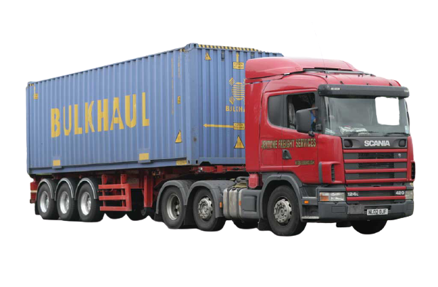
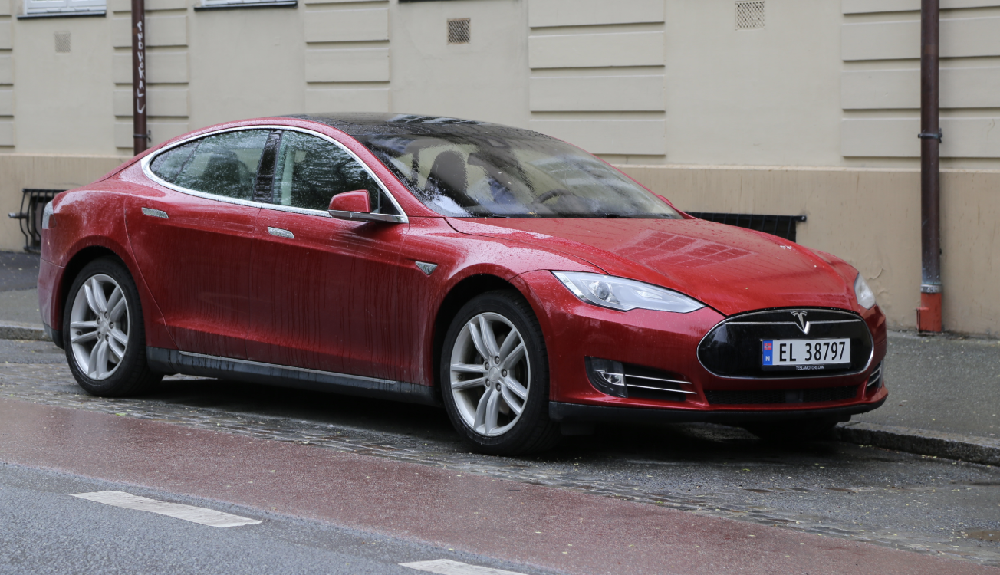
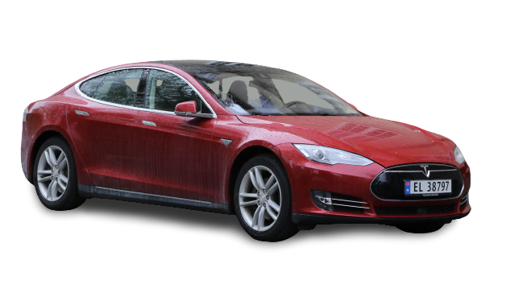

# cvnet
Build Model for Computer Vision(CV) Neural Network.

## 图像分类

## 图像分割

- 语义分割
- 实例分割
- 全景分割

### 技术演化路径

1. 2010年前，传统分割：1）边缘检测；2）遗传算法
2. 2010-2015年，机器学习：1）随机森林；2）支持向量机
3. 2015年后，深度学习：1）经典分割算法：FCN, U-Net, SegNet, DeepLab; 2)实时分割算法：ENet, LinkNet, BiSeNet, DFANet, Light-Weight RefineNet; 3)RGB-D分割算法：RedNet, RDFNet

### Networks implemented

* [PSPNet](https://arxiv.org/abs/1612.01105) - With support for loading pretrained models w/o caffe dependency
* [ICNet](https://arxiv.org/pdf/1704.08545.pdf) - With optional batchnorm and pretrained models
* [FRRN](https://arxiv.org/abs/1611.08323) - Model A and B
* [FCN](https://arxiv.org/abs/1411.4038) - All 1 (FCN32s), 2 (FCN16s) and 3 (FCN8s) stream variants
* [U-Net](https://arxiv.org/abs/1505.04597) - With optional deconvolution and batchnorm
* [Link-Net](https://codeac29.github.io/projects/linknet/) - With multiple resnet backends
* [Segnet](https://arxiv.org/abs/1511.00561) - With Unpooling using Maxpool indices

#### Upcoming

* [E-Net](https://arxiv.org/abs/1606.02147)
* [RefineNet](https://arxiv.org/abs/1611.06612)

### DataLoaders implemented

* [CamVid](http://mi.eng.cam.ac.uk/research/projects/VideoRec/CamVid/)
* [Pascal VOC](http://host.robots.ox.ac.uk/pascal/VOC/voc2012/segexamples/index.html)
* [ADE20K](http://groups.csail.mit.edu/vision/datasets/ADE20K/)
* [MIT Scene Parsing Benchmark](http://data.csail.mit.edu/places/ADEchallenge/ADEChallengeData2016.zip)
* [Cityscapes](https://www.cityscapes-dataset.com/)

### Demo

1. demo site: https://www.remove.bg/upload
2. 演示效果：

demo1:

remove background:

demo2:

remove background:

# Reference
1. [ClassyVision](https://github.com/facebookresearch/ClassyVision)
2. [Deep-Learning-Project-Template](https://github.com/L1aoXingyu/Deep-Learning-Project-Template)
3. [pytorch-semseg](https://github.com/meetshah1995/pytorch-semseg)
4. [torchcv](https://github.com/donnyyou/torchcv)
5. [pytorch-cnn-finetune](https://github.com/creafz/pytorch-cnn-finetune)
6. [PaddleOCR](https://github.com/PaddlePaddle/PaddleOCR)