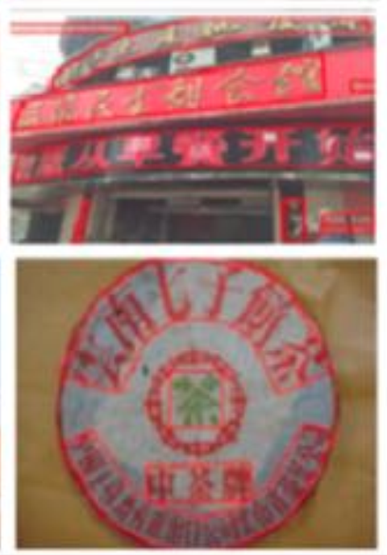

# OCR

## 什么是OCR
OCR，光学字符识别（Optical Character Recognition），指对图像中的文字进行识别，并获取文本结果。常见于拍照检测、文档识别、证照票据识别、车牌识别、
自然场景文本定位识别等，相关技术在数字时代得到广泛应用。

### 应用场景

- 文本拍照识别
- 证照票据识别
- 车牌识别
- 拍照搜题
- 算术题拍照检查
- 招牌识别
- 内容审核

### 技术难点

| 难点 | 说明 | 案例 |
| :------- | :--------- | :--------- |
| 复杂版式 | 表格、目录文本 |  |
| 扭曲变形 | 书本翻页、纸张褶皱 |  |
| 笔迹干扰、手写、涂改 | 答卷 |  |
| 不均匀光照、反光、弱光 | 侧面光照、阴影 |  |
| 失焦、运动模糊、摩尔纹 | 运动照片 |  |
| 复杂背景 | 彩色背景 |  |
| 多字体、多语言混排 | 课本封面 |  |
| 角度、弯曲、变形 | logo、图章 |  |

## OCR实现流程

CRNN
- CTC

