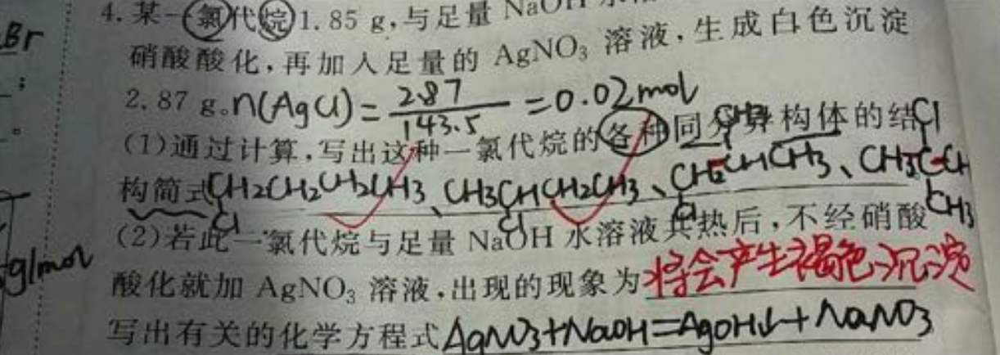

# OCR

## 什么是OCR
OCR，光学字符识别（Optical Character Recognition），指对图像中的文字进行识别，并获取文本结果。常见于拍照检测、文档识别、证照票据识别、车牌识别、
自然场景文本定位识别等，相关技术在数字时代得到广泛应用。


### 应用场景

- 文本拍照识别
- 证照票据识别
- 车牌识别
- 拍照搜题
- 算术题拍照检查
- 招牌识别
- 内容审核


### 技术难点

| 难点 | 说明 | 案例 |
| :------- | :--------- | :--------- |
| 复杂版式 | 表格、目录文本 |  |
| 扭曲变形 | 书本翻页、纸张褶皱 |  |
| 笔迹干扰、手写、涂改 | 答卷 |  |
| 不均匀光照、反光、弱光 | 侧面光照、阴影 |  |
| 失焦、运动模糊、摩尔纹 | 运动照片 |  |
| 复杂背景 | 彩色背景 |  |
| 多字体、多语言混排 | 课本封面 |  |
| 角度、弯曲、变形 | logo、图章 |  |


## OCR实现流程

一般流程是：输入 -> 文本检测 -> 文本识别 -> 输出

- 文本检测：解决的问题是哪里有文字，文字的范围有多少
- 文本识别：对定位好的文字区域进行识别，主要解决的问题是每个文字是什么，将图像中的文字区域转化为字符信息

### 模型

#### 文本检测算法
- DB([paper](https://arxiv.org/abs/1911.08947))（推荐）
- EAST([paper](https://arxiv.org/abs/1704.03155))
- SAST([paper](https://arxiv.org/abs/1908.05498))

#### 文本识别算法
- CRNN([paper](https://arxiv.org/abs/1507.05717))（推荐）
- Rosetta([paper](https://arxiv.org/abs/1910.05085))
- STAR-Net([paper](http://www.bmva.org/bmvc/2016/papers/paper043/index.html))
- RARE([paper](https://arxiv.org/abs/1603.03915v1))
- SRN([paper](https://arxiv.org/abs/2003.12294))

## 讨论

#### 基于深度学习的文字检测方法有哪几种？各有什么优缺点？
常用的基于深度学习的文字检测方法一般可以分为基于回归的、基于分割的两大类，当然还有一些将两者进行结合的方法。
1. 基于回归的方法分为box回归和像素值回归。a. 采用box回归的方法主要有CTPN、Textbox系列和EAST，这类算法对规则形状文本检测效果较好，
但无法准确检测不规则形状文本。 b. 像素值回归的方法主要有CRAFT和SA-Text，这类算法能够检测弯曲文本且对小文本效果优秀但是实时性能不够。
2. 基于分割的算法，如PSENet，这类算法不受文本形状的限制，对各种形状的文本都能取得较好的效果，但是往往后处理比较复杂，导致耗时严重。
目前也有一些算法专门针对这个问题进行改进，如DB，将二值化进行近似，使其可导，融入训练，从而获取更准确的边界，大大降低了后处理的耗时。

#### 对于中文行文本识别，CTC和Attention哪种更优？
1. 从效果上来看，通用OCR场景CTC的识别效果优于Attention，因为带识别的字典中的字符比较多，常用中文汉字三千字以上，
如果训练样本不足的情况下，对于这些字符的序列关系挖掘比较困难。中文场景下Attention模型的优势无法体现。而且Attention适合短语句识别，
对长句子识别比较差。
2. 从训练和预测速度上，Attention的串行解码结构限制了预测速度，而CTC网络结构更高效，预测速度上更有优势。

## Future

目前来看，深度学习时代之下的场景文字检测与识别技术依然存在巨大挑战，其主要体现在以下 3 个方面：1）文字的差异性，存在着语言、字体、方向、
排列等各种各样的形态；2）背景的复杂性，比如几乎无法区分的元素（标志、篱笆、墙砖、草地等）；3）干扰的多样性，诸如噪声、模糊、失真、低分辨率、光照不均匀、部分遮挡等情况。


相应而言，针对上述挑战，文字检测与识别具体研究有着以下 4 个技术趋势：1）设计更强大的模型；2）识别多方向、弯曲文字；3）识别多语言文字；
4）合成更丰富逼真的数据集。


## Getting Started
### Dependency
- This work was tested with PyTorch 1.3.1, CUDA 10.1, python 3.6 and Ubuntu 16.04. <br> You may need `pip3 install torch==1.3.1`. <br>
In the paper, expriments were performed with **PyTorch 0.4.1, CUDA 9.0**.
- requirements : lmdb, pillow, torchvision, nltk
```
pip3 install lmdb pillow torchvision nltk
```

### Download lmdb dataset for traininig and evaluation from [here](https://drive.google.com/drive/folders/192UfE9agQUMNq6AgU3_E05_FcPZK4hyt)
data_lmdb_release.zip contains below. <br>
training datasets : [MJSynth (MJ)](http://www.robots.ox.ac.uk/~vgg/data/text/)[1] and [SynthText (ST)](http://www.robots.ox.ac.uk/~vgg/data/scenetext/)[2] \
validation datasets : the union of the training sets [IC13](http://rrc.cvc.uab.es/?ch=2)[3], [IC15](http://rrc.cvc.uab.es/?ch=4)[4], [IIIT](http://cvit.iiit.ac.in/projects/SceneTextUnderstanding/IIIT5K.html)[5], and [SVT](http://www.iapr-tc11.org/mediawiki/index.php/The_Street_View_Text_Dataset)[6].\
evaluation datasets : benchmark evaluation datasets, consist of [IIIT](http://cvit.iiit.ac.in/projects/SceneTextUnderstanding/IIIT5K.html)[5], [SVT](http://www.iapr-tc11.org/mediawiki/index.php/The_Street_View_Text_Dataset)[6], [IC03](http://www.iapr-tc11.org/mediawiki/index.php/ICDAR_2003_Robust_Reading_Competitions)[7], [IC13](http://rrc.cvc.uab.es/?ch=2)[3], [IC15](http://rrc.cvc.uab.es/?ch=4)[4], [SVTP](http://openaccess.thecvf.com/content_iccv_2013/papers/Phan_Recognizing_Text_with_2013_ICCV_paper.pdf)[8], and [CUTE](http://cs-chan.com/downloads_CUTE80_dataset.html)[9].

### Run demo with pretrained model
1. Download pretrained model from [here](https://drive.google.com/drive/folders/15WPsuPJDCzhp2SvYZLRj8mAlT3zmoAMW)
2. Add image files to test into `demo_image/`
3. Run demo.py (add `--sensitive` option if you use case-sensitive model)
```
CUDA_VISIBLE_DEVICES=0 python3 demo.py \
--Transformation TPS --FeatureExtraction ResNet --SequenceModeling BiLSTM --Prediction Attn \
--image_folder demo_image/ \
--saved_model TPS-ResNet-BiLSTM-Attn.pth
```


### Training and evaluation
1. Train CRNN[10] model
```
CUDA_VISIBLE_DEVICES=0 python3 train.py \
--train_data data_lmdb_release/training --valid_data data_lmdb_release/validation \
--select_data MJ-ST --batch_ratio 0.5-0.5 \
--Transformation None --FeatureExtraction VGG --SequenceModeling BiLSTM --Prediction CTC
```
2. Test CRNN[10] model. If you want to evaluate IC15-2077, check [data filtering part](https://github.com/clovaai/deep-text-recognition-benchmark/blob/c27abe6b4c681e2ee0784ad966602c056a0dd3b5/dataset.py#L148).
```
CUDA_VISIBLE_DEVICES=0 python3 test.py \
--eval_data data_lmdb_release/evaluation --benchmark_all_eval \
--Transformation None --FeatureExtraction VGG --SequenceModeling BiLSTM --Prediction CTC \
--saved_model saved_models/None-VGG-BiLSTM-CTC-Seed1111/best_accuracy.pth
```

3. Try to train and test our best accuracy model TRBA (**T**PS-**R**esNet-**B**iLSTM-**A**ttn) also. ([download pretrained model](https://drive.google.com/drive/folders/15WPsuPJDCzhp2SvYZLRj8mAlT3zmoAMW))
```
CUDA_VISIBLE_DEVICES=0 python3 train.py \
--train_data data_lmdb_release/training --valid_data data_lmdb_release/validation \
--select_data MJ-ST --batch_ratio 0.5-0.5 \
--Transformation TPS --FeatureExtraction ResNet --SequenceModeling BiLSTM --Prediction Attn
```
```
CUDA_VISIBLE_DEVICES=0 python3 test.py \
--eval_data data_lmdb_release/evaluation --benchmark_all_eval \
--Transformation TPS --FeatureExtraction ResNet --SequenceModeling BiLSTM --Prediction Attn \
--saved_model saved_models/TPS-ResNet-BiLSTM-Attn-Seed1111/best_accuracy.pth
```

### Arguments
* `--train_data`: folder path to training lmdb dataset.
* `--valid_data`: folder path to validation lmdb dataset.
* `--eval_data`: folder path to evaluation (with test.py) lmdb dataset.
* `--select_data`: select training data. default is MJ-ST, which means MJ and ST used as training data.
* `--batch_ratio`: assign ratio for each selected data in the batch. default is 0.5-0.5, which means 50% of the batch is filled with MJ and the other 50% of the batch is filled ST.
* `--data_filtering_off`: skip [data filtering](https://github.com/clovaai/deep-text-recognition-benchmark/blob/f2c54ae2a4cc787a0f5859e9fdd0e399812c76a3/dataset.py#L126-L146) when creating LmdbDataset.
* `--Transformation`: select Transformation module [None | TPS].
* `--FeatureExtraction`: select FeatureExtraction module [VGG | RCNN | ResNet].
* `--SequenceModeling`: select SequenceModeling module [None | BiLSTM].
* `--Prediction`: select Prediction module [CTC | Attn].
* `--saved_model`: assign saved model to evaluation.
* `--benchmark_all_eval`: evaluate with 10 evaluation dataset versions, same with Table 1 in our paper.

## Download failure cases and cleansed label from [here](https://drive.google.com/drive/folders/1W84gS9T5GU5l5Wp3VV1aeXIIKV87yjRm)
image_release.zip contains failure case images and benchmark evaluation images with cleansed label.


## When you need to train on your own dataset or Non-Latin language datasets.
1. Create your own lmdb dataset.
```
pip3 install fire
python3 create_lmdb_dataset.py --inputPath data/ --gtFile data/gt.txt --outputPath result/
```
The structure of data folder as below.
```
data
├── gt.txt
└── test
    ├── word_1.png
    ├── word_2.png
    ├── word_3.png
    └── ...
```
At this time, `gt.txt` should be `{imagepath}\t{label}\n` <br>
For example
```
test/word_1.png Tiredness
test/word_2.png kills
test/word_3.png A
...
```
2. Modify `--select_data`, `--batch_ratio`, and `opt.character`, see [this issue](https://github.com/clovaai/deep-text-recognition-benchmark/issues/85).


## Acknowledgements
This implementation has been based on these repository [crnn.pytorch](https://github.com/meijieru/crnn.pytorch), [ocr_attention](https://github.com/marvis/ocr_attention).

## Reference
[1] M. Jaderberg, K. Simonyan, A. Vedaldi, and A. Zisserman. Synthetic data and artificial neural networks for natural scenetext  recognition. In Workshop on Deep Learning, NIPS, 2014. <br>
[2] A. Gupta, A. Vedaldi, and A. Zisserman. Synthetic data fortext localisation in natural images. In CVPR, 2016. <br>
[3] D. Karatzas, F. Shafait, S. Uchida, M. Iwamura, L. G. i Big-orda, S. R. Mestre, J. Mas, D. F. Mota, J. A. Almazan, andL. P. De Las Heras. ICDAR 2013 robust reading competition. In ICDAR, pages 1484–1493, 2013. <br>
[4] D. Karatzas, L. Gomez-Bigorda, A. Nicolaou, S. Ghosh, A. Bagdanov, M. Iwamura, J. Matas, L. Neumann, V. R.Chandrasekhar, S. Lu, et al. ICDAR 2015 competition on ro-bust reading. In ICDAR, pages 1156–1160, 2015. <br>
[5] A. Mishra, K. Alahari, and C. Jawahar. Scene text recognition using higher order language priors. In BMVC, 2012. <br>
[6] K. Wang, B. Babenko, and S. Belongie. End-to-end scenetext recognition. In ICCV, pages 1457–1464, 2011. <br>
[7] S. M. Lucas, A. Panaretos, L. Sosa, A. Tang, S. Wong, andR. Young. ICDAR 2003 robust reading competitions. In ICDAR, pages 682–687, 2003. <br>
[8] T. Q. Phan, P. Shivakumara, S. Tian, and C. L. Tan. Recognizing text with perspective distortion in natural scenes. In ICCV, pages 569–576, 2013. <br>
[9] A. Risnumawan, P. Shivakumara, C. S. Chan, and C. L. Tan. A robust arbitrary text detection system for natural scene images. In ESWA, volume 41, pages 8027–8048, 2014. <br>
[10] B. Shi, X. Bai, and C. Yao. An end-to-end trainable neural network for image-based sequence recognition and its application to scene text recognition. In TPAMI, volume 39, pages2298–2304. 2017.
