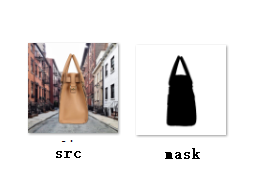
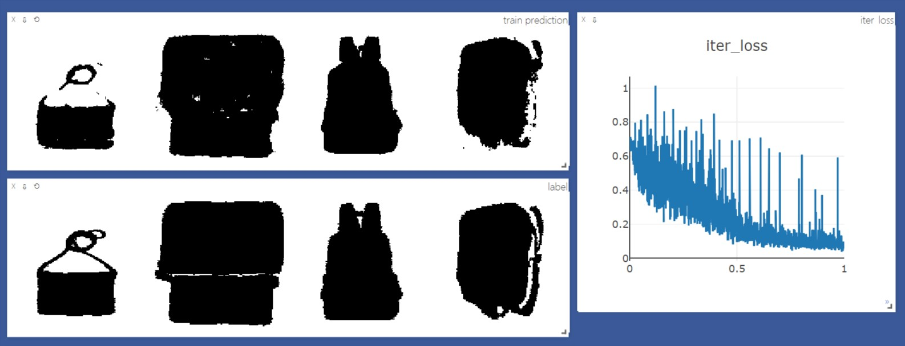

# pytorch FCN easiest demo


这个repo是在读论文[Fully Convolutional Networks for Semantic Segmentation](http://arxiv.org/abs/1411.4038)时的一个pytorch简单复现，数据集很小，是一些随机背景上的一些包的图片（所有数据集大小一共不到80M），如下图



> 关于此数据集详细信息，见[数据集](#数据集)

根据论文实现了FCN32s、FCN16s、FCN8s和FCNs

>部分代码参考了[这个repo](https://github.com/wkentaro/pytorch-fcn)

使用visdom可视化，运行了20个epoch后的可视化如下图：





## 1.如何运行


* 打开终端，输入
```sh
python fcn_train.py --data_dir="/home/users/xuming06/workspace/cv/DataSet/bag"
```
* 若没有问题可以打开浏览器输入`http://localhost:8097/`来使用`visdom`可视化


## 2. 数据集

* training data来自[这里](https://github.com/yunlongdong/FCN-pytorch-easiest/tree/master/last)，ground-truth来自[这里](https://github.com/yunlongdong/FCN-pytorch-easiest/tree/master/last_msk)。
* 链接中提供的图片中，部分ground-truth的有误，而且部分有ground-truth的图片没有对应training data的图片，将这些有错误的图片分别剔除，重新编号排序之后剩余533张图片。
* 之后我随机选取了67张图片**旋转180度**，一共在training data和ground-truth分别凑够600张图片（0.jpg ~ 599.jpg）。


## 3. 包含文件

### 3.1 [train.py](train.py)

* 训练网络与可视化
* 主函数

### 3.2 [fcn.py](fcn.py)

* FCN32s、FCN16s、FCN8s、FCNs网络定义
* VGGNet网络定义、VGG不同种类网络参数、构建VGG网络的函数

### 3.3 [bag_data.py](bag_data.py)

* 定义方便PyTorch读取数据的Dataset和DataLoader
* 定义数据的变换transform